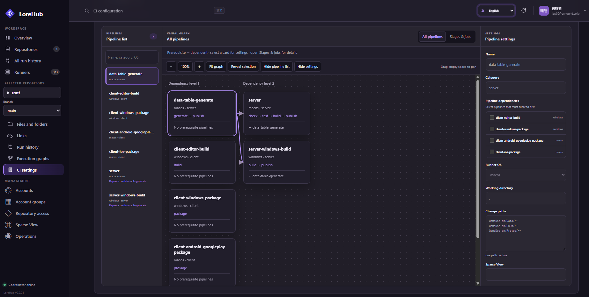

# LoreHub

LoreHub is a Lore VCS development platform that brings CI execution into a coordinator and worker service. The web dashboard manages Lore repositories, starts pipelines for a specific revision, and shows status, jobs, logs, and cancellation controls. Pipeline settings are read from the `.lore-ci.toml` included in the requested revision.

LoreHub does not use Git checkouts, GitLab APIs, or Git commit SHAs. It uses Lore's 64-character revision hashes.

```text
User ── Google login (`@zenogrid.co.kr`)
      │ session cookie + CSRF token
      │ POST /api/v1/pipelines
      ▼
 API coordinator ───── PostgreSQL
      ▲
      │ HTTPS: claim / heartbeat / status / logs
 Rust workers × N
                           │
                 lore clone --revision HASH
                           │
                    .lore-ci.toml
                           │
                     /bin/sh -e
```

## Project layout

```text
src/main.rs             CLI arguments and process signals
src/server/             HTTP server, Google OIDC, and APIs
src/ci/                 pipeline configuration, queue, state, and logs
src/runner/             workers and shell executor
src/vcs/lore.rs         Lore CLI command construction
migrations/             PostgreSQL schema
examples/               .lore-ci.toml examples
web/                    embedded dashboard HTML, CSS, and JavaScript
```

The binary and Rust crate are both named `lorehub`. `lorehub serve` starts the coordinator and `lorehub worker` starts a worker. Lore arguments are built by `vcs`; child environment variables, timeouts, and process termination are handled by `runner`.

## Migrating from lore-runner

| Previous | LoreHub |
| --- | --- |
| `lore-runner` binary / `lore_runner` crate | `lorehub` |
| Static API bearer token | Google Workspace login session |
| `LORE_RUNNER_BIND` | `LOREHUB_BIND` |
| `LORE_RUNNER_WORK_DIR` | `LOREHUB_WORK_DIR` |
| `lore-runner-api.service` | `lorehub-api.service` |
| `lore-runner-worker@.service` | `lorehub-worker@.service` |
| `/etc/lore-runner/environment` | `/etc/lorehub/environment` |
| `RUST_LOG=lore_runner=info` | `RUST_LOG=lorehub=info` |

The coordinator requires `DATABASE_URL`, `GOOGLE_CLIENT_ID`, `GOOGLE_CLIENT_SECRET`, and `LOREHUB_PUBLIC_URL`. Workers do not require `DATABASE_URL`. Existing `LORE_BIN`, `/api/v1`, `.lore-ci.toml`, and `LORE_*` job variables remain valid. Legacy static tokens and `LORE_RUNNER_*` settings are not read. Migration `0002_google_auth.sql` adds authentication tables without changing pipeline, job, or log data.

## Features

- Google Workspace OIDC restricted to `@zenogrid.co.kr`.
- Responsive dashboard with repository, branch, pipeline, status, and text filters.
- Expandable repository trees with `LINK` badges and revision-pinned reads.
- Repository links with pinned revisions, automatic/manual synchronization, and retryable operations.
- Visual/TOML CI editing, dependency graphs, change-path preview, validation, undo, redo, and diffs.
- Pipeline details with execution graphs, status, jobs, and paged logs.
- System, light, and dark themes.
- Runner inventory, Docker status, maintenance mode, bounded retries, heartbeats, leases, and self-update verification.
- PostgreSQL sessions, HttpOnly/SameSite cookies, CSRF protection, atomic job claiming, and embedded migrations.

The shell executor runs POSIX shell on Linux and PowerShell on Windows. Jobs have the worker account's file and network permissions; use a dedicated account or VM. This executor is not a sandbox.

## Repository navigation

The workspace menu contains **Overview**, **Repositories**, and **Runners**. The **Selected repository** picker searches by name or URL and keeps the selection while navigating **Files and folders**, **Links**, **Run history**, **Execution graphs**, and **CI settings**. The selected branch is shown below the picker.

Repository and branch selection are stored in URLs such as `#repository-tree?repository=URL&branch=NAME`. They survive navigation, reload, and browser Back/Forward. The browser remembers the selection per account and restores it only while the repository is accessible. Unscoped run history URLs remain available for direct links and workspace activity filters.

`GET /api/v1/repositories/{name}/tree?revision=HASH&path=PATH` checks login and repository access and returns immediate nodes with `name`, `kind`, and `is_link`. The root uses an empty `path`; file contents are never downloaded.

## CI settings and execution graphs

### CI settings

**CI settings** provides Visual and TOML editing for the selected repository and branch, dependency edges, change-path preview, server validation, undo/redo, and line-based diffs. Preview and analysis do not commit, push, or run pipelines.

Repositories used as a Lore link's **Source Repository** are read-only in CI settings so their source content remains controlled by the link relationship. When `.lore-ci.toml` is missing, LoreHub offers a starter build template; editing and saving the template creates the configuration in a new revision. New pipeline runs are started from this page after reviewing the selected branch configuration.



### Execution graphs

**Execution graphs** keeps each run's recorded snapshot separate from the current configuration. Historical OS, paths, and stages are never replaced by new settings. Selecting a job shows status, duration, exit code, and paged logs. Wait reasons are derived from server claim evidence; the UI does not invent a dependency blocker when no corresponding run exists.

Read-only execution analysis is available at `GET /api/v1/pipelines/{id}/insights`. It reports related runs, queue and execution timelines, and conservative comparisons with matching previous runs.

## Repository links

Links connect **Source → Root**. Lore revisions are authoritative for pins; PostgreSQL stores synchronization policy, last success/error, and operation history. Automatic synchronization watches source pushes, while manual synchronization changes Root only when requested. Source-directory creation is enabled by default, and failed Root creation can be retried without reverting the Source commit.

Migration `0024_repository_link_management.sql` is applied when a coordinator starts. The main endpoints are:

| Endpoint | Purpose |
| --- | --- |
| `GET /api/v1/repository-links/summary` | Link counts by accessible Root and branch |
| `POST /api/v1/repositories/{name}/links/policy` | Change branch, path, revision, or auto-update |
| `GET /api/v1/repositories/{name}/link-operations?branch=main` | Recent operations |
| `POST /api/v1/repositories/{name}/link-operations/{id}/retry` | Retry a failed operation |

POST endpoints require CSRF protection. Run `node tests/web-links-preview.mjs` for an isolated local UI fixture.

## Running locally

Requirements are Rust 1.88+, PostgreSQL 18, the Lore CLI, and an accessible Lore server. Workers run on Linux, Windows, and macOS.

```bash
cd /Users/law80/GitHub/lorehub
cargo build --locked
docker compose up -d postgres
cp .env.example .env
set -a
. ./.env
set +a
cargo run --locked -- serve
```

Create a Google OAuth **Web application** client and register `http://127.0.0.1:8080/auth/google/callback`. In another terminal, start a worker with `cargo run --locked -- worker`, then open `http://127.0.0.1:8080/`. Frontend assets are embedded in the Rust binary, so no Node build or separate static server is required.

## Lore services and CLI access

Compose can run DynamoDB + S3 and Local File backends:

```text
lores://127.0.0.1:41337/<repository>   # DynamoDB + S3
lores://127.0.0.1:41338/<repository>   # Local File
```

Configure the corresponding Lore server URL variables in the coordinator environment. Back up `dynamodb_data` together with its S3 payloads; S3 objects alone cannot restore mutable repository state. Existing local repositories need a Lore store migration or a repository-level push.

After login, the Repository page can issue a one-hour CLI access token. Treat it as a bearer credential and keep it out of shell history. Workers issue a short-lived JWT immediately before cloning and pass it to Lore with `--identity-token` and `--access-token`; workers never connect directly to PostgreSQL.

## Pipeline configuration

Place `.lore-ci.toml` at the Lore repository root and push the revision before running it. See [examples/.lore-ci.toml](examples/.lore-ci.toml) and [examples/monorepo.lore-ci.toml](examples/monorepo.lore-ci.toml).

Automatic `[[pipelines]]` routes use exact, case-sensitive paths and `directory/**` patterns. `needs` may reference earlier or same-stage jobs; unknown, duplicate, self, and cyclic dependencies are rejected. Each job runs in its own `/bin/sh -e -c` process, while commands in one job share a shell. Output is bounded and the working directory is removed after completion.

## Authentication and access control

`/auth/google/login` starts Google login with the `zenogrid.co.kr` hosted-domain hint. The callback verifies signature, issuer, audience, expiry, nonce, hosted domain, and verified email. The immutable Google `sub` identifies the user.

Repository lists, history, graphs, details, logs, and analysis apply current repository access. Owners, permitted account-group owners and members, and administrators may access a repository. Saving a Sparse View preset does not grant access. Unauthorized details return `404`, unauthorized history cursors return `400`, and cancellation also requires the original requester or an administrator.

## Verification

```bash
node --test tests/*.test.mjs
cargo test --locked --no-default-features --lib
cargo fmt --check
cargo clippy --locked --all-targets --all-features -- -D warnings
```

Database-backed tests use the disposable PostgreSQL wrapper:

```bash
sh scripts/with-test-postgres.sh cargo test --locked --no-default-features --test pipeline_access -- --ignored
```

Preview fixtures for the repository tree, CI editor, execution graphs, and repository links bind to localhost, use in-memory data, and never connect to production Lore or PostgreSQL.

## Operations and administration

The administrator **Operations** page reports queued work, Runner availability, repository checks, and PostgreSQL usage. It refreshes while open and treats failed refreshes as stale. It does not perform automatic alerts, retries, or cleanup.

Administrators can use **Accounts**, **Account groups**, **Repository access**, **Sparse View**, and **Operations**. These pages and APIs are administrator-only; ordinary users and group members receive `403`. Sparse View presets are reusable repository patterns and do not change repository access or existing local workspaces automatically.

Runner maintenance pauses new assignments while existing work drains. Runner registration, claim, heartbeat, status, and log APIs use the coordinator's JWT-authenticated HTTP API. Claim requests are idempotent by request ID, transient network failures use bounded retries, and automatic updates verify release size and SHA-256 before installation.

## Security notes

Run workers with a dedicated operating-system account or VM. Keep JWT keys, OAuth secrets, database URLs, and CLI tokens out of logs and source control. The shell executor is intended for trusted repository content and does not provide a sandbox.
